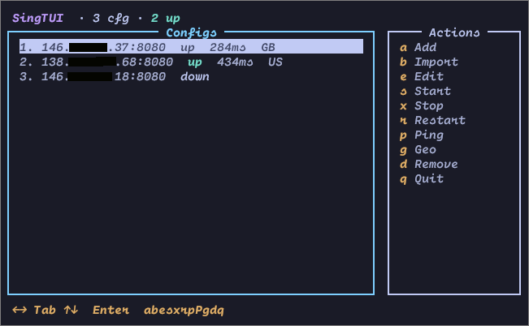

# SingTUI

> **This code was written by AI (Grok, built by xAI).**

Dual-pane TUI for managing multiple [sing-box](https://github.com/SagerNet/sing-box) instances — in the spirit of `nmtui`.



- Add configs from a built-in template or import share links / JSON from the clipboard  
- Start / stop / restart each instance as a **systemd user service**  
- Ping latency and geo-lookup through the local mixed inbound  
- Edit configs with your `$EDITOR`

---

## Requirements

| Dependency | Purpose |
|---|---|
| [sing-box](https://github.com/SagerNet/sing-box) | Proxy core (`sing-box` on `$PATH` or `/usr/local/bin/sing-box`) |
| Python 3.8+ | Runtime (stdlib only — no pip packages) |
| systemd | User services (`systemctl --user`) |
| Optional: `curl` | Faster / more reliable ping & geo |
| Optional: `wl-paste` / `xclip` / `xsel` / `pbpaste` | Clipboard import |

---

## Install

```bash
git clone https://github.com/s2sadeghi/singtui.git
cd singtui
chmod +x singtui.py

# Install as `singtui` on PATH
ln -s "$(pwd)/singtui.py" ~/.local/bin/singtui

singtui
```

Data lives under:

```
~/.config/singtui/
├── configs/           # config-1.json, config-2.json, …
└── cache.json         # ping / geo cache (30 min TTL)

~/.config/systemd/user/
└── singtui-config-N.service
```

---

## Usage

```
singtui              # launch the TUI
singtui -h           # print help
```

### Keyboard

| Key | Action |
|-----|--------|
| `←` `→` / `Tab` | Switch focus (Configs ↔ Actions) |
| `↑` `↓` / `j` `k` | Move selection |
| `Enter` | On config: start if down, stop if up · On action: run it |
| `a` | **Add** — new config from built-in template (next free port) |
| `b` | **Import** — read clipboard (share URI or full sing-box JSON) |
| `e` | **Edit** — open selected config in `$EDITOR` (default `nano`) |
| `s` | **Start** selected instance |
| `x` | **Stop** selected instance |
| `r` | **Restart** selected instance |
| `p` | **Ping** selected (must be up) |
| `P` | **Ping all** currently-up instances |
| `g` | **Geo** (country code via ip-api.com, must be up) |
| `d` | **Remove** config + systemd unit (asks confirmation) |
| `q` / `Esc` | Quit |

### Ports

Each config gets its own local mixed inbound:

| Config | Port |
|--------|------|
| `config-1.json` | `2081` |
| `config-2.json` | `2082` |
| … | `2080 + N` |

Point your apps / system proxy at `http://127.0.0.1:<port>` or `socks5://127.0.0.1:<port>`.

### Built-in template

**Add** (`a`) creates a minimal config (mixed inbound + direct/block).  
Press `e` to insert your outbound, or use **Import** (`b`).

### Import from clipboard (`b`)

Copy a share link or a full sing-box JSON config, then press `b`.

**Supported share URI schemes:**

| Scheme | Protocol |
|--------|----------|
| `ss://` | Shadowsocks (SIP002 + legacy) |
| `vmess://` | VMess (base64 JSON) |
| `vless://` | VLESS (TLS / Reality, ws / grpc / …) |
| `trojan://` | Trojan |
| `hysteria2://` / `hy2://` | Hysteria2 |
| `hysteria://` | Hysteria v1 |
| `tuic://` | TUIC |
| `anytls://` | AnyTLS |
| `socks://` / `socks5://` | SOCKS |
| `http://` / `https://` | HTTP CONNECT proxy |

Also accepts a raw **sing-box JSON** object (`inbounds` / `outbounds`).

Transports and TLS options commonly found in share links (WebSocket, gRPC, HTTP, Reality, uTLS fingerprints, ALPN, flow, …) are mapped into sing-box fields automatically.

---

## License

Use freely. No warranty.
